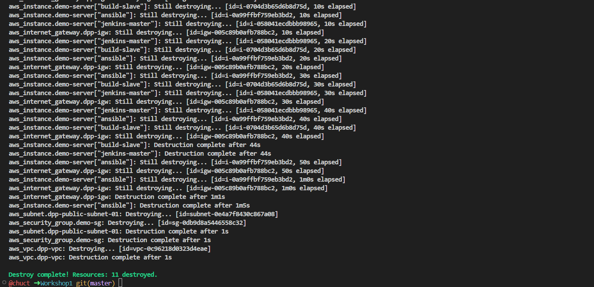

# Quản lý tài nguyên AWS bằng Terraform


## 1. Giới thiệu
Terraform là một công cụ mã nguồn mở cho phép định nghĩa cơ sở hạ tầng của mình dưới dạng mã (Infrastructure as Code - IaC). Với Terraform, có thể quản lý, cung cấp và cấu hình tài nguyên trên AWS và các nhà cung cấp đám mây khác một cách tự động và nhất quán.

## 2. Cài đặt Terraform
### 2.1. Yêu cầu
- Hệ điều hành: Linux, macOS, hoặc Windows.
- Phiên bản Terraform: Tải từ [trang chính thức của Terraform](https://www.terraform.io/downloads.html).
- AWS CLI: Để tương tác với các dịch vụ AWS.

### 2.2. Hướng dẫn cài đặt
1. Tải về Terraform từ trang chính thức.
2. Giải nén và thêm đường dẫn thư mục Terraform vào biến môi trường `PATH`.
3. Kiểm tra cài đặt bằng lệnh:
   ```bash
   terraform -version
   ```
<p align="center">
    
<p>
<p align="center"><i>Hình 1: Kiểm tra Terraform đã được cài đặt thành công.</i></p>

## 3. Cấu hình tài khoản AWS

### 3.1. Thiết lập AWS CLI

1. **Cài đặt AWS CLI**: Làm theo hướng dẫn tại [đây](https://docs.aws.amazon.com/cli/latest/userguide/install-cliv2.html).

2. **Cấu hình AWS CLI** với các thông tin truy cập AWS bằng lệnh sau:

   ```bash
   aws configure
3. **Kiểm tra**: Sau khi cấu hình, chạy lệnh sau để kiểm tra AWS CLI và đảm bảo rằng nó hoạt động bình thường:
   ```bash
   aws sts get-caller-identity
<p align="center">
    
<p>
<p align="center"><i>Hình 2: Kiểm tra cấu hình AWS CLI.</i></p>

## 4. Giới thiệu về một file Terraform mẫu

Trong Terraform, file `.tf` chứa các cấu hình để tạo và quản lý tài nguyên hạ tầng trên AWS. Dưới đây là một ví dụ thực tế về việc sử dụng Terraform để triển khai một số tài nguyên AWS, bao gồm EC2 instances, VPC, Subnets, và Security Groups.

### 4.1. Mẫu cấu hình Terraform
```hcl
# Cấu hình provider AWS
provider "aws" {
  region = "us-east-1"
}

# Tạo các EC2 instances với các tên cụ thể
resource "aws_instance" "demo-server" {
  ami           = "ami-0e86e20dae9224db8"
  instance_type = "t2.micro"
  key_name      = "project2-keypair"
  
  # Sử dụng security group đã tạo và subnet cụ thể
  vpc_security_group_ids = [aws_security_group.demo-sg.id]
  subnet_id              = aws_subnet.dpp-public-subnet-01.id
  
  # Sử dụng vòng lặp để tạo nhiều instances
  for_each = toset(["jenkins-master", "build-slave", "ansible"])
  
  tags = {
    Name = "${each.key}"
  }
}

# Tạo một Security Group cho phép truy cập SSH và Jenkins
resource "aws_security_group" "demo-sg" {
  name        = "demo-sg"
  description = "SSH Access"
  vpc_id      = aws_vpc.dpp-vpc.id
  
  # Thiết lập rule cho phép truy cập SSH
  ingress {
    description = "SSH access"
    from_port   = 22
    to_port     = 22
    protocol    = "tcp"
    cidr_blocks = ["0.0.0.0/0"]
  }

  # Thiết lập rule cho phép truy cập Jenkins
  ingress {
    description = "Jenkins port"
    from_port   = 8080
    to_port     = 8080
    protocol    = "tcp"
    cidr_blocks = ["0.0.0.0/0"]
  }

  # Cho phép mọi outbound traffic
  egress {
    from_port        = 0
    to_port          = 0
    protocol         = "-1"
    cidr_blocks      = ["0.0.0.0/0"]
    ipv6_cidr_blocks = ["::/0"]
  }

  tags = {
    Name = "ssh-prot"
  }
}

# Tạo một VPC mới
resource "aws_vpc" "dpp-vpc" {
  cidr_block = "10.1.0.0/16"
  tags = {
    Name = "dpp-vpc"
  }
}

# Tạo các Subnets công khai trong VPC
resource "aws_subnet" "dpp-public-subnet-01" {
  vpc_id                  = aws_vpc.dpp-vpc.id
  cidr_block              = "10.1.1.0/24"
  map_public_ip_on_launch = true
  availability_zone       = "us-east-1a"
  
  tags = {
    Name = "dpp-public-subent-01"
  }
}

resource "aws_subnet" "dpp-public-subnet-02" {
  vpc_id                  = aws_vpc.dpp-vpc.id
  cidr_block              = "10.1.2.0/24"
  map_public_ip_on_launch = true
  availability_zone       = "us-east-1b"
  
  tags = {
    Name = "dpp-public-subent-02"
  }
}

# Tạo một Internet Gateway để cho phép kết nối Internet
resource "aws_internet_gateway" "dpp-igw" {
  vpc_id = aws_vpc.dpp-vpc.id
  
  tags = {
    Name = "dpp-igw"
  }
}

# Tạo Route Table công khai và liên kết với Internet Gateway
resource "aws_route_table" "dpp-public-rt" {
  vpc_id = aws_vpc.dpp-vpc.id
  
  route {
    cidr_block = "0.0.0.0/0"
    gateway_id = aws_internet_gateway.dpp-igw.id
  }
}

# Liên kết Route Table với các Subnets công khai
resource "aws_route_table_association" "dpp-rta-public-subnet-01" {
  subnet_id      = aws_subnet.dpp-public-subnet-01.id
  route_table_id = aws_route_table.dpp-public-rt.id
}

resource "aws_route_table_association" "dpp-rta-public-subnet-02" {
  subnet_id      = aws_subnet.dpp-public-subnet-02.id
  route_table_id = aws_route_table.dpp-public-rt.id
}
```

### 4.2. Quy trình triển khai Terraform
1. Khởi tạo dự án: Chạy lệnh `terraform init` để khởi tạo dự án Terraform và tải về các provider cần thiết.
<p align="center">
    
<p>
<p align="center"><i>Hình 3: Quá trình khởi tạo dự án Terraform với lệnh `terraform init`.</i></p>

2. Kiểm tra kế hoạch triển khai: Sử dụng lệnh `terraform plan` để xem trước các thay đổi sẽ được thực hiện trên cơ sở hạ tầng.
<p align="center">
    
<p>
<p align="center"><i>Hình 4: Quá trình kiểm tra kế hoạch triển khai bằng lệnh `terraform plan`.</i></p>


3. Triển khai tài nguyên: Chạy lệnh `terraform apply` để thực hiện các thay đổi và triển khai tài nguyên AWS.
<p align="center">
    
<p>
<p align="center"><i>Hình 5: Chạy lệnh `terraform apply`.</i></p>
<p align="center">
    
<p>
<p align="center"><i>Hình 6: Kiểm tra tài nguyên đã triển khai trên AWS bằng cách truy cập giao diện quản lý của AWS.</i></p>

4. Xóa tài nguyên: Khi không còn cần thiết, có thể xóa tài nguyên bằng lệnh `terraform destroy`.
<p align="center">
    
</p>
<p align="center"><i>Hình 4: Quá trình xóa tài nguyên với lệnh `terraform destroy`. Lệnh này sẽ xóa tất cả các tài nguyên đã được tạo bởi Terraform và đưa hạ tầng về trạng thái ban đầu.</i></p>

<p align="center">
    
</p>
<p align="center"><i>Hình 5: Thông báo xác nhận việc xóa tài nguyên thành công sau khi chạy lệnh `terraform destroy`. Hình ảnh này hiển thị kết quả khi tất cả các tài nguyên đã được xóa và Terraform thông báo rằng không còn tài nguyên nào để quản lý.</i></p>

## 5. Kết luận

Thông qua các bước từ cài đặt Terraform, cấu hình AWS CLI, triển khai và quản lý tài nguyên, đến việc xóa tài nguyên không còn cần thiết, đã có thể làm chủ công cụ này và áp dụng nó vào các dự án của mình. Terraform không chỉ giúp quản lý tài nguyên một cách hiệu quả mà còn nâng cao khả năng kiểm soát và tự động hóa các quy trình quản lý cơ sở hạ tầng.

